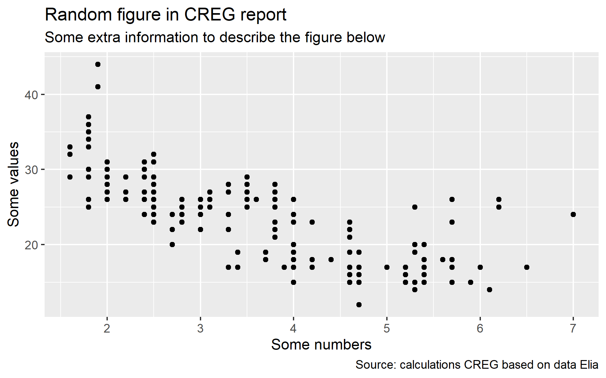
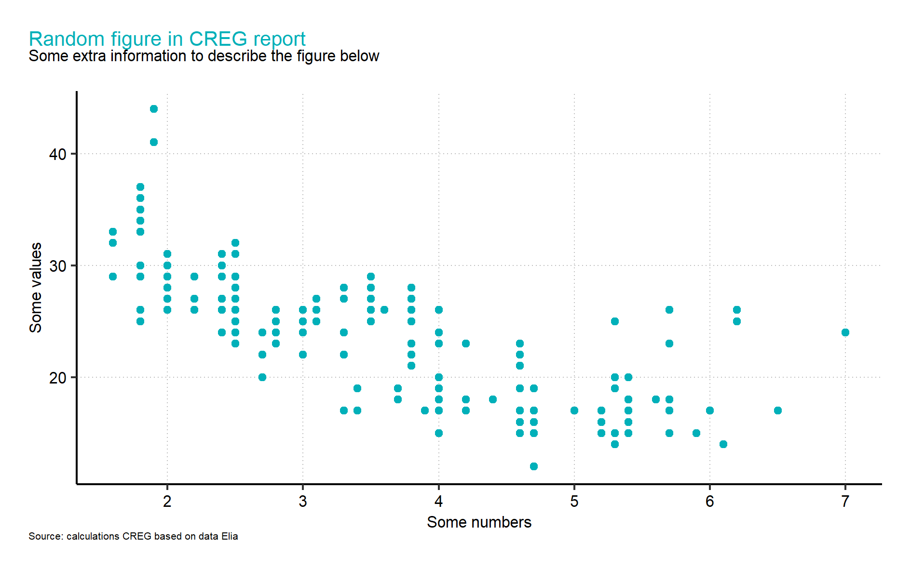

# CREGR
## Short description

This package contains a number of functions to apply custom theme and layout elements to ggplot visuals. These are based on the "CREG Style Guide" which may be found on Z:\Charte graphique-Logo CREG.

Other functions include wrappers to easily import single or multiple files from CREG's Data Warehouse (DWH) into single dataframes, including an additional DateTime variable to uniquely identify each observation within the different variables.

The package will be updated regularly with additional functions.

## How to install

Installing the package may be done directly from source, through the following commands:

```{r}
install.packages("devtools")
devtools::install_github("nicoschoutteet/CREGR")
library(CREGR)
```

## List of functions
* colour_CREG()
* theme_CREG()
* loadcsv_CREG()
* save_CREG()

The suffix "_CREG" is used to distinguish these functions from existing tidyverse versions of the same functions.

Information on how to use these functions (including which arguments to declare) may be found in the dedicated description pages, accessible via the "?" command:

```{r}
?theme_CREG()
```

## Example
These functions allow to easily modify style and theme elements, to turn default ggplot output (top) into the custom CREG output (bottom):





## Questions?
Questions or comments may be addressed to Nico Schoutteet - nico.schoutteet@creg.be
